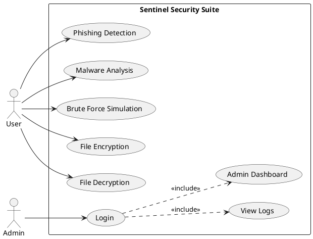
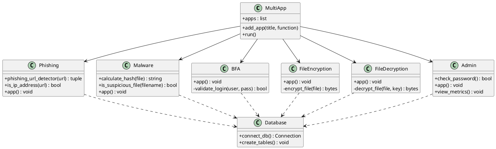
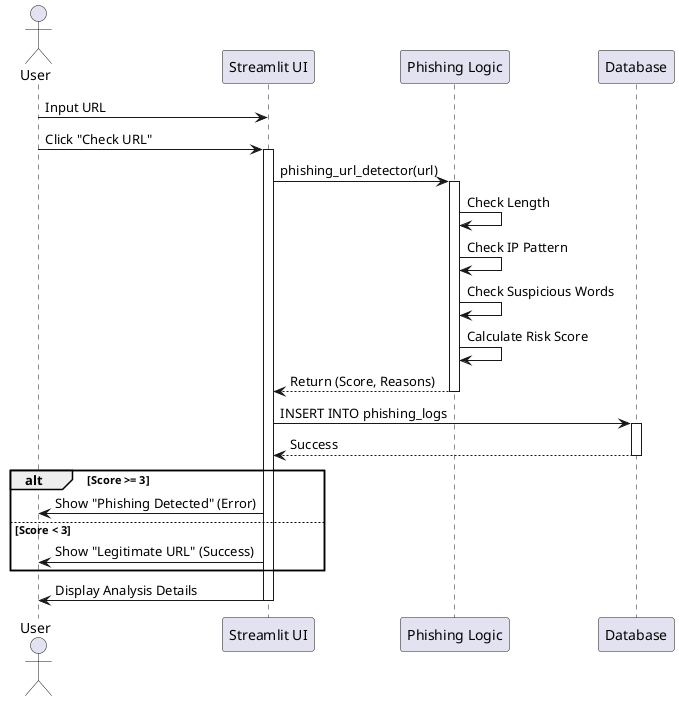
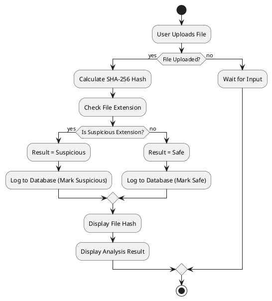
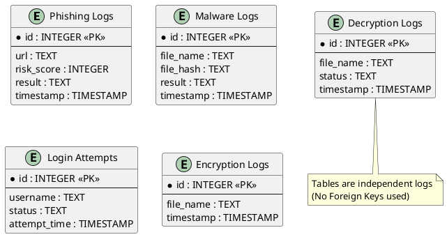
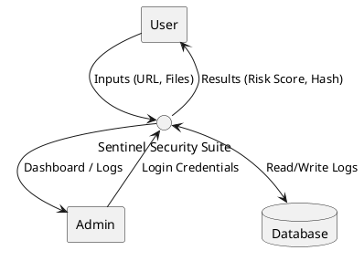
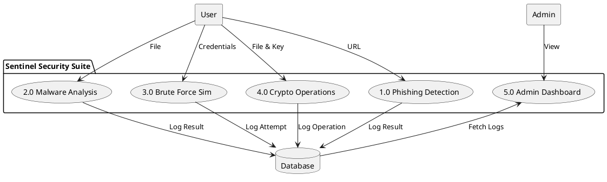
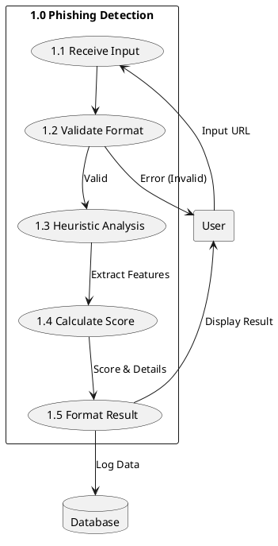

# System Diagrams (PlantUML Syntax)

You can render these diagrams using any PlantUML viewer (like the PlantUML extension for VS Code) or online at [planttext.com](https://www.planttext.com/).

## 1. Use Case Diagram

## 2. Class Diagram

## 3. Sequence Diagram (Phishing Detection)

## 4. Activity Diagram (Malware Analysis)

## 5. Entity-Relationship (E-R) Diagram

## 6. Data Flow Diagrams (DFD)

### Level 0: Context Diagram

### Level 1: System Breakdown

### Level 2: Phishing Module Detail

